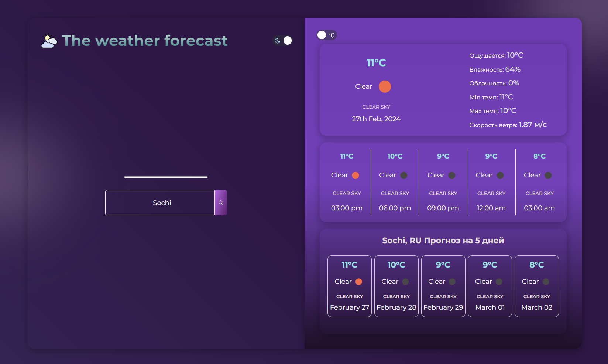

Приложение создано с помощью OpenWeathermap - это открытый Api погоды и сервисов. 

Для запуска приложения введите команды npm i, npm run dev. 

При первом запуске браузер может запросить разрешение на получение местоположения, согласитесь. После этого будет отображаться текущая погода в вашем городе и прогноз на 5 дней. 

В поиске вы можете ввести любое название города и также получите текущую погоду и прогноз. 

